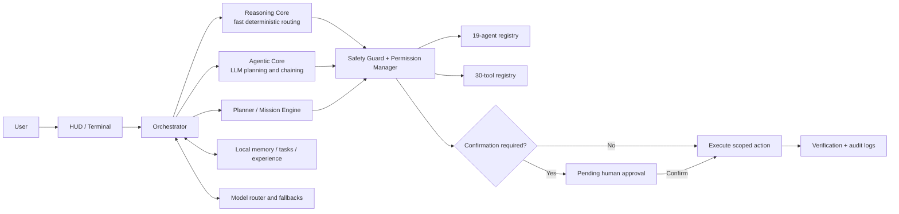

# JARVIS AI Assistant

> A modular, safety-gated personal AI operating system for voice interaction, desktop automation, research, business operations, memory, and bounded autonomous workflows.

[](https://www.python.org/)
[](config/settings.json)
[](#platform-support)
[](SAFETY_PROTOCOL.md)

JARVIS is not a single chatbot script. It is an agent-and-tool runtime built around one orchestrator, multiple model providers, persistent local memory, a browser-based HUD, and explicit permission boundaries. The same core powers the dashboard and terminal interfaces.

Current repository snapshot:

- **19 specialist agents** loaded from `config/agents.json`
- **30 tool integrations** loaded from `config/tools.json`
- **5 model profiles**: Claude, Gemini, NVIDIA NIM, Perplexity, and local Ollama
- **Two interfaces**: voice-enabled web HUD and terminal mode
- **Three permission tiers** with confirmation gates and audit logging
- **146 collected tests** across core behavior, agent council logic, and hardening

## What JARVIS can do

- Route natural-language requests to deterministic commands, specialist agents, or an LLM planning loop.
- Research live information, create briefs, summarize sources, and maintain reusable knowledge packs.
- Open approved applications, control supported browser/media actions, inspect system status, and automate bounded desktop workflows.
- Manage local notes, tasks, memories, business knowledge, and project-scoped files.
- Draft marketing content, customer-support responses, business strategy, and e-commerce recommendations.
- Coordinate multi-agent reviews through research, implementation, testing, security, and strategy roles.
- Run proactive monitors and queued missions within configured budgets and permission boundaries.
- Accept typed or spoken commands through the local HUD and optionally synthesize multilingual replies.

Actions involving deletion, overwriting, shell commands, installation, external communication, system changes, money, or trading are not silently executed. They are held behind the permission system described in [Safety model](#safety-model).

## Architecture



Every executable action returns through the same safety and permission boundary, regardless of whether it originated from a rule, an agent, or an LLM-generated plan.

## Quick start

### Requirements

- Python **3.10 or newer**
- Git
- Windows 10/11 for the complete desktop-control feature set
- Chrome or Edge for the best dashboard voice experience
- An Anthropic API key for the current canonical launcher

> **Current startup behavior:** `main.py` validates `ANTHROPIC_API_KEY` before starting. Ollama and the other provider profiles are supported by the model router, but the canonical launcher still requires this key at boot.

### Windows

```powershell
git clone https://github.com/DEWARAJ/jarvis-ai-assistant.git
cd jarvis-ai-assistant

Copy-Item .env.example .env
# Open .env and set ANTHROPIC_API_KEY

.\setup.bat
.\.venv\Scripts\python.exe main.py
```

The default interface opens at `http://127.0.0.1:8765/`.

### Linux or macOS

```bash
git clone https://github.com/DEWARAJ/jarvis-ai-assistant.git
cd jarvis-ai-assistant

cp .env.example .env
# Open .env and set ANTHROPIC_API_KEY

bash setup.sh
.venv/bin/python main.py
```

The orchestration, research, memory, and web interfaces are portable. Windows application control, Task Scheduler integration, SAPI speech, and some desktop tools are Windows-specific.

## Run modes

| Command | Result |
|---|---|
| `python main.py` | Launch the default HUD and open the browser |
| `python main.py --terminal` | Run the text-only terminal interface |
| `python main.py --no-open` | Start the dashboard without opening a browser |
| `python main.py --port 9000` | Start the dashboard on a custom port |
| `python gui.py` | Launch the dashboard through the compatibility entry point |

Do not use `jarvis_main.py` or `agent_fabric.py` as entry points. They belong to the deprecated runtime; the live system uses `core/orchestrator.py`.

## First commands to try

```text
help
status
doctor
what's the situation
daily briefing
research practical AI agents for small businesses
advise me on improving an ecommerce conversion funnel
add task review this week's operating metrics
show tasks
show agents
show tools
voice status
```

Desktop commands depend on the operating system, installed optional packages, and the configured allowlists. Risky requests may create a pending action that must be followed by `confirm`.

## Dashboard and voice

`python main.py` starts a standard-library `ThreadingHTTPServer` and serves:

- `/` — default JARVIS HUD
- `/classic` — classic dashboard
- `/api/bootstrap` — available agents, tools, and runtime status
- `/api/status` — current system and model state
- `/api/alerts` — proactive alert queue
- `/api/greeting` — contextual greeting and briefing
- `/api/tts` — optional synthesized speech response
- `POST /api/command` — submit a command to the orchestrator

The HUD supports typed commands, browser speech recognition, spoken replies, wake-word behavior, barge-in, and a conversation mode. Browser speech features work best in Chrome or Edge. Optional neural English, Telugu, and Hindi speech requires the additional voice packages installed by the autonomous toolkit.

## Model routing

Model profiles live in `config/settings.json` and secrets belong only in `.env`.

| Profile | Provider | Intended use | Credential |
|---|---|---|---|
| `claude` | Anthropic | Default deep reasoning and vision | `ANTHROPIC_API_KEY` |
| `gemini` | Google OpenAI-compatible API | Fast general tasks and fallback | `GEMINI_API_KEY` |
| `nvidia` | NVIDIA NIM | OpenAI-compatible cloud inference | `NVIDIA_API_KEY` |
| `perplexity` | Perplexity | Current-information research | `PERPLEXITY_API_KEY` |
| `ollama` | Local Ollama server | Private/offline inference | No key |

With smart routing enabled, JARVIS selects a profile by task type and falls through the configured provider chain when a model is unavailable. You can pin a provider with commands such as `use claude`, `use gemini`, `use nvidia`, `use perplexity`, or `use ollama`.

Never put a real credential in `config/settings.json`, source files, memory files, issues, or commits. Copy `.env.example` to `.env`; `.env` is already ignored by Git.

## Specialist agents

The runtime currently registers 19 agents:

| Group | Agents |
|---|---|
| Executive council | `executive`, `ultron`, `friday`, `tron`, `ira`, `mythos` |
| Business and customer operations | `business_strategy`, `ecommerce`, `marketing`, `content`, `customer_support` |
| Building and operations | `research`, `automation`, `coding`, `testing`, `security`, `memory`, `personal_companion`, `trading_research` |

Each agent has a declared scope and risk level. The agent registry isolates loading failures so one unavailable specialist does not crash the whole runtime.

## Tool system

The 30 configured tools cover these surfaces:

- **Knowledge and productivity:** files, notes, tasks, business knowledge, research, news, weather, and Firecrawl.
- **Desktop and system:** approved applications, screenshots, keyboard/mouse input, volume, processes, network controls, terminal, and system diagnostics.
- **Browser and media:** URL/search actions, controlled Playwright browsing, and YouTube playback controls.
- **Business workflows:** customer-support drafting, e-commerce analysis, automation planning, connectors, email reading, and trading research.
- **Extended runtimes:** Hermes integration, utilities, and confirm-gated skill installation.

Tool availability is capability-dependent. Missing optional packages should degrade individual tools rather than prevent the entire agent registry from loading.

## Safety model

JARVIS uses three action tiers defined in `config/permissions.json`:

1. **Allowed:** reversible, scoped actions such as reading project files, researching, drafting, creating notes/tasks, and opening approved applications.
2. **Requires confirmation:** shell commands, installation, file moves, external accounts, messages, posts, system changes, and other elevated actions.
3. **Explicit/high-impact:** deletion, overwriting, spending, trading, shutdown/restart, and edits to business-critical files.

Additional protections include:

- Prompt-injection handling: webpages, emails, files, and tool output are treated as data—not authority.
- Secrets are read from environment variables and are not intentionally stored in memory or logs.
- Destructive file operations require a backup path.
- Side-effecting actions are not blindly retried.
- The token-gated LAN remote server is disabled by default and refuses to start without `JARVIS_REMOTE_TOKEN`.
- Self-rewrite is disabled; upgrade and installation operations remain confirmation-gated.

Read [SAFETY_PROTOCOL.md](SAFETY_PROTOCOL.md), [MASTER_PERMISSIONS.md](MASTER_PERMISSIONS.md), and [AUTONOMY_FRAMEWORK.md](AUTONOMY_FRAMEWORK.md) before enabling elevated capabilities.

## Configuration

| File | Purpose |
|---|---|
| `config/settings.json` | Runtime, model routing, voice, proactive monitoring, autonomy, vision, and remote-control settings |
| `config/agents.json` | Specialist-agent modules, scopes, and risk levels |
| `config/tools.json` | Tool registry and implementation classes |
| `config/permissions.json` | Allowed, confirm-required, explicit, and forbidden capabilities |
| `.env` | Local secrets; never committed |
| `business_knowledge/` | Local operating context used by business agents |
| `skills_knowledge/` | Persisted knowledge skill packs |

## Project structure

```text
jarvis-ai-assistant/
├── main.py                 # canonical launcher
├── core/                   # orchestrator, reasoning, memory, safety, missions
├── agents/                 # specialist agent implementations
├── tools/                  # scoped tool implementations
├── channels/               # terminal, dashboard, voice, LAN remote control
├── ui/                     # HUD and classic dashboard
├── config/                 # settings, registries, and permissions
├── proactive/              # system, schedule, file, threat, and market monitors
├── modules/                # system/application capability modules
├── business_knowledge/     # user-maintained business context
├── skills_knowledge/       # learned domain packs
├── plugin/jarvis-ai-os/    # companion plugin specification
├── tests/                  # core, council, and hardening tests
└── docs/                   # architecture and implementation notes
```

## Testing

Install the dependencies, then run:

```powershell
.\.venv\Scripts\python.exe -m pytest
```

```bash
.venv/bin/python -m pytest
```

The current checkout collects **146 tests**:

- 117 core tests
- 4 council tests
- 25 hardening tests

Some integration-style checks exercise real timeout, background, or capability behavior and can take several minutes. A clean collection count is not the same as a passing test run; use the final pytest exit code as the authority.

## Platform support

JARVIS is **Windows-first**. The Python orchestration layer and local web UI can run on Linux or macOS, but complete functionality varies:

| Capability | Windows | Linux/macOS |
|---|---:|---:|
| Dashboard and terminal | Yes | Yes |
| LLM routing and research | Yes | Yes |
| Notes, tasks, memory, agents | Yes | Yes |
| Browser dashboard voice | Chrome/Edge | Browser-dependent |
| Windows app/process/input control | Yes | Limited or unavailable |
| Windows Task Scheduler greetings | Yes | No |
| SAPI fallback speech | Yes | No |

## Operational boundaries

- This is an evolving personal automation project, not a hardened multi-tenant production service.
- Do not expose the dashboard or LAN command server directly to the public internet.
- Review permission overrides before enabling external accounts, system control, or connector access.
- Trading features are research, journaling, and risk tooling. Live autonomous trading is forbidden by default.
- Desktop automation can be affected by focus, screen layout, OS permissions, and optional dependency availability.
- Back up important files before enabling write, move, delete, or self-update workflows.

## Further documentation

- [Canonical entry points](README_ENTRYPOINT.md)
- [Project state and implemented capabilities](PROJECT_STATE.md)
- [System blueprint](docs/BLUEPRINT.md)
- [Cognition architecture](docs/JARVIS_COGNITION.md)
- [Realtime voice roadmap](docs/REALTIME_JARVIS.md)
- [Plugin alignment](docs/PLUGIN_ALIGNMENT.md)
- [Server map](SERVER_MAP.md)
- [Roadmap and open work](TODO.md)

## Contributing

Keep contributions scoped, safety-preserving, and testable:

1. Create a feature branch.
2. Preserve the confirmation gate for destructive, external, financial, credential, installation, and self-modifying actions.
3. Add or update tests for behavior changes.
4. Run the relevant test suite.
5. Document new tools, agents, permissions, environment variables, and platform limitations.

When reporting a problem, include the operating system, Python version, launch command, relevant optional dependencies, and sanitized logs. Never include API keys or credentials.

---

Built as an experimental personal AI operating system: capable by design, bounded by explicit permissions.
